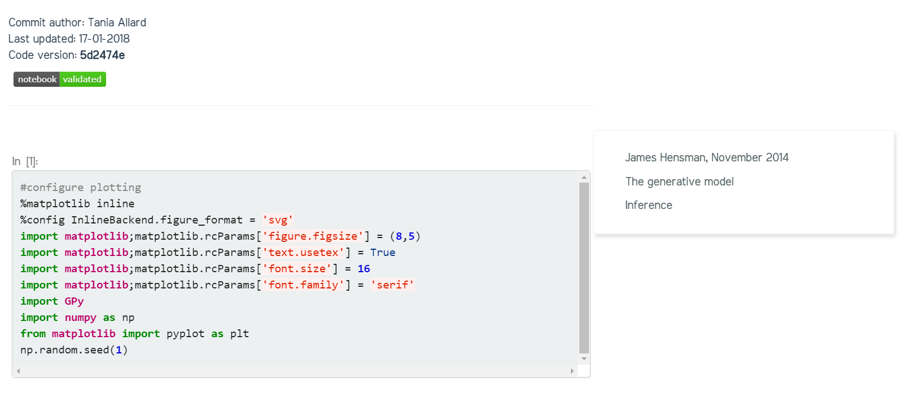

# Advanced features

Modules template was designed having in mind those academics that use technologies
such as Jupyter notebooks for their lectures and research dissemination. Thus we have added extra functionalities for you.

## ✨ Launching your notebooks in Microsoft Azure notebooks
Let's say you have your class notebooks in this repository (or even another one). If you want to import your notebooks and add an extra button to your site follow the next steps.

- Create an account at [Microsfot Azure Notebooks](https://notebooks.azure.com)
- Add the following to the top `README.md` file of **the repository containing the notebooks**
```
<a href="https://notebooks.azure.com/import/gh/<your username>/<your repository>"></a>
```
- Commit and push the changes to GitHub

This will add the following badge to your repo README:
<a href="https://notebooks.azure.com/import/gh/trallard/Modules_template"></a>

You will then be able to click on the `launch azurenb` badge and automatically import the notebooks to [Microsoft Azure Notebooks](https://notebooks.azure.com).
*_Make sure to copy your library url for the following steps._*

Once you have the notebooks in a Microsoft Azure Notebooks library you can add a 'launch in Azure notebooks'
button to your notebooks within your static website (like the one shown below).


- To do so, you need to set the azure variable in your `_config.yml`  file to true e.g:
```
azure: true
```
If you do not have your notebooks in Azure notebooks only comment the line with a
`#`.

Then you can supply an Azure library per collection (e.g. if you're using this site
for various course modules) by specifying this in your `_config.yml`:
```
collections:
  - module1
    azure: "https://notebooks.azure.com/trallard/libraries/BAD-days"
    output: true
```

**IMPORTANT:**  the variable needs to be declared as azure to be then added to the
rendered notebooks

---

## ✨ Converting Jupyter notebooks to Jekyll posts
You can convert your notebooks locally into a Jekyll compliant post using the [nbjekyll](https://github.com/trallard/nbjekyll) package.

### Pre-requisites
- Python > 3.4
- pytest
- nbjekyll (install using `pip install nbjekyll`)
- pygit2 (if you use conda the easiest way to get this installed is by doing `conda install -c conda-forge pygit2`)
- nbval (install using `pip install nbval`)

### How do I do it?
<ol>
  <li> Add your Jupyter notebook to the corresponding collection (e.g. `_Day1`) </li>
  <li> Commit the notebook to Git </li>
```bash
git add Tutorial.ipynb
git commit -m Add Tutorial
```
  <li> From the command line use nbjekyll to convert your notebooks: </li>
```bash
python -m nbjekyll.convert_nbs
```

If everything goes ok you should see a new `.md` file with the same title of your notebook and the output images in `./images/notebook_images/`. To get more information on nbjekyll go to [https://github.com/trallard/nbjekyll](https://github.com/trallard/nbjekyll)

Your newly converted notebooks will look something like this:



### Do I need to commit before converting?

**Yes**.

As you can see in the image above, the rendered notebook shows the following information:

- The code version (sha1 for the latest version, or Git commit)
- When it was last updated and by whom
- Badge indicating validation: this is done using *nbval* and tells you if your notebook is broken

If your notebooks are not committed to your version control system nbjekyll will not be able to convert and add the super nice and informative heading!

---

## ✨ Enabling Continuous Integration for your site

Testing your software regularly makes it easier to find and fix bugs 🐛. Your newly created Jekyll website can be automatically tested using Travis CI, follow the next steps:

1. Go to [https://travis-ci.org/](https://travis-ci.org/) and sign in using your GitHub account.
2. In the upper right corner click on your name (or choose Accounts) to open your Travis-ci profile.
You'll be presented with the list of your GitHub projects (only the ones where you have administrative authority) e.g.
3. Enable Travis CI on your site repository 

We have provided the necessary `.travis.yml` file and a script `scripts/site_check` within Modules template. So the next time you push your changes to GitHub Travis CI will check your site for broken links, images, and missing HTML tags.
